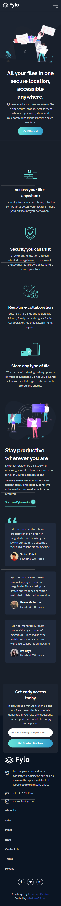
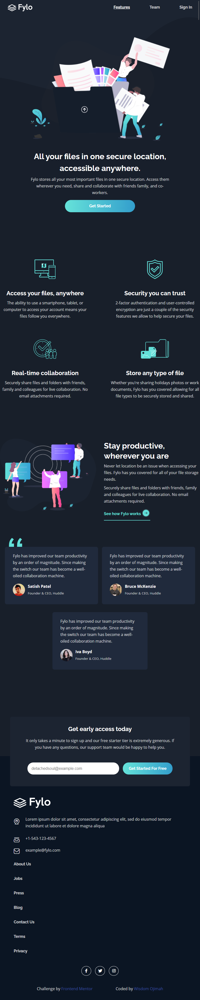

# Frontend Mentor - Fylo dark theme landing page solution

This is a solution to the [Fylo dark theme landing page challenge on Frontend Mentor](https://www.frontendmentor.io/challenges/fylo-dark-theme-landing-page-5ca5f2d21e82137ec91a50fd). Frontend Mentor challenges help you improve your coding skills by building realistic projects. 

## Table of contents

- [Overview](#overview)
  - [The challenge](#the-challenge)
  - [Screenshot](#screenshot)
  - [Live Demo](https://detachedsoul.github.io/fylo-dark-theme-landing-page/)
- [My process](#my-process)
  - [Built with](HTML, CSS, and JavaScript)
  - [Useful resources][Raleway](https://fonts.google.com/specimen/Raleway)
  - [Useful resources][Open Sans](https://fonts.google.com/specimen/Open+Sans)
- [Author](Wisdom Ojimah)

## Overview

### The challenge

Users should be able to:

- View the optimal layout for the site depending on their device's screen size
- See hover states for all interactive elements on the page

### Screenshot

### Links

- Solution URL: [Code Source](https://github.com/detachedsoul/fylo-dark-theme-landing-page)
- Live Site URL: [Live Demo](https://detachedsoul.github.io/fylo-dark-theme-landing-page/)

### Built with

- Semantic HTML5 markup
- CSS custom properties
- Flexbox
- CSS Grid
- Mobile-first workflow

## Author

- Website - [Website](https://wisdomojimah.000webhostapp.com)
- Facebook - [Facebook](web.facebook.com/IamWisdomOjimah)
- Frontend Mentor - [Username](https://www.frontendmentor.io/profile/detachedsoul)
